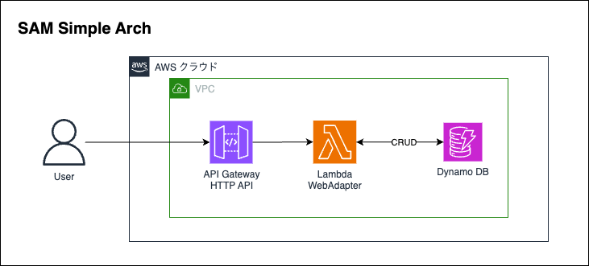

# sam-react-on-fastapi

## アーキテクチャ図


## 環境構築

```bash
# miseの信頼設定とインストール
mise trust
mise install

# プロジェクトのセットアップ（フロントエンド・バックエンド・ローカルDynamoDB）
task setup
```

## 開発

### ローカル開発

フロントエンドとバックエンドを同時に起動:

```bash
task serve
```

個別に起動:

```bash
# フロントエンドのみ
task serve/frontend

# バックエンドのみ
task serve/backend
```

### Docker 開発

```bash
# Dockerイメージのビルドと実行
task docker

# イメージのビルドのみ
task docker/build

# イメージの実行のみ
task docker/run

# Dockerコンテナの停止
task docker/stop
```

### Docker Compose

```bash
# Docker Composeの起動（DynamoDBなどのサービスを含む）
task docker-compose/up

# Docker Composeの停止
task docker-compose/down
```

## API クライアント生成

バックエンドAPIからフロントエンド用のクライアントコードを生成:

```bash
# OpenAPI仕様の生成とOrvalによるクライアント生成
task generate/api-client

# OpenAPI仕様のみ生成
task openapi/generate

# Orvalによるクライアント生成のみ
task orval/generate
```

## AWS SAM デプロイ

```bash
# SAMビルド
task sam/build

# SAMデプロイ
task sam/deploy
task sam/deploy/guided #初回のみ

# SAMリソースの削除
task sam/remove
```

## プロジェクト構成

- `frontend/` - React フロントエンドアプリケーション
- `backend/` - FastAPI バックエンドアプリケーション
- `docker-compose.yml` - ローカル開発環境の設定
- `Dockerfile` - アプリケーションのコンテナ化設定
- `template.yaml` - AWS SAM テンプレート
- `Taskfile.yml` - タスク定義
